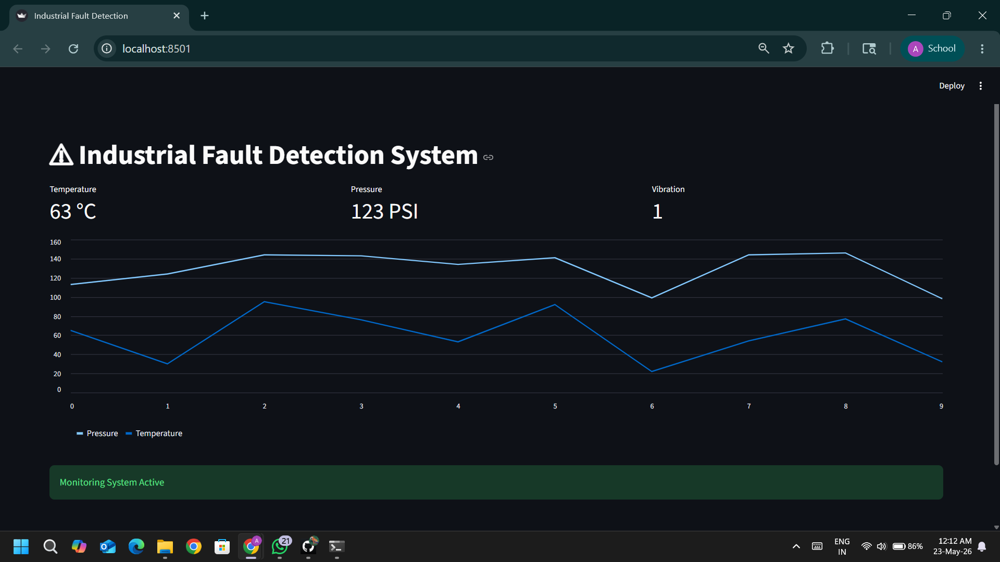

# Industrial Fault Detection System

Python based industrial fault detection system for monitoring machine conditions and generating real-time fault alerts.

---

## Dashboard Preview

---

## Run Locally

bash
pip install -r requirements.txt
streamlit run dashboard/main.py

---

## Overview

Industrial Fault Detection System is a Python-based project designed to monitor industrial machine parameters and generate fault alerts when abnormal conditions are detected.

The project simulates industrial monitoring systems used in automation and predictive maintenance applications.

---

## Features

- Machine fault monitoring
- Temperature analysis
- Pressure monitoring
- Fault alert generation
- Real-time dashboard simulation
- Industrial safety monitoring

---

## Technologies Used

- Python
- Streamlit
- Pandas
- Matplotlib

---

## Applications

- Industrial automation
- Predictive maintenance
- Machine monitoring
- Industrial safety systems

---

## Future Improvements

- AI-based fault prediction
- IoT sensor integration
- Cloud monitoring
- Real-time analytics

---

## Author

Ankur
student
ICE
